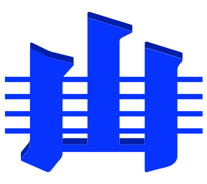

## International Commission on Stratigraphy (ICS)
<https://stratigraphy.org>

### Executive

Chair: **Elisabetta Erba**  
Professor, Department of Earth Sciences  
University of Milan  
Email: <elisabetta.erba@unimi.it>

Vice Chair: **Shuzhong Shen**  
Professor and Academician, School of Earth Sciences and Engineering  
Nanjing University  
e-mail: <szshen@nju.edu.cn>

Secretary-General: **Charles Henderson**  
Professor, Department of Earth, Energy and Environment  
University of Calgary  
Email: <cmhender@ucalgary.ca>

### Executive (non-voting members):

Webmaster: **Nicholas Car**  
Data Architect / Research Fellow 
KurrawongAI / Australian National University  
Email: <nick@kurrawong.ai>

Graphics Officer: **Kim Cohen**  
Department of Physical Geography  
Utrecht University  
Email: <k.m.cohen@uu.nl>
 
### Subcommission executives

Please see <https://stratigraphy.org/subcommissions>.