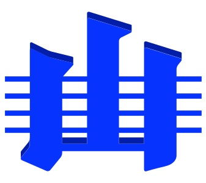

# International Commission on Stratigraphy (ICS)

The International Commission on Stratigraphy is the largest and oldest constituent scientific body in the International Union of Geological Sciences (IUGS). Its primary objective is to precisely define global units (systems, series, and stages) of the International Chronostratigraphic Chart that, in turn, are the basis for the units (periods, epochs, and age) of the International Geologic Time Scale; thus setting global standards for the fundamental scale for expressing the history of the Earth.

ICS website: <https://stratigraphy.org>

* [International Chronostratigraphic Chart](#chart)
* [Global Stratotype Section and Point (GSSP)](#gssps)

## International Chronostratigraphic Chart

The authoritative International Chronostratigraphic Chart is online at <https://stratigraphy.org/chart> where it can be accessed in interactive form or as a PDF file. It wil available in multiple languages and multiple previous version of it are kept too.

The interactive form can change the timescale scaling too, to give different perceptions of the span of geological time the Chart covers.

### Correlation tables & charts

In addition to the Chart, the ICS maintains global chronostratigraphical correlation tables and charts that correlate regional chronostratigraphic units worldwide. See <https://stratigraphy.org/chart> for:

* Global chronostratigraphical correlation table for the last 2.7 million years 
* Ordovician Chronostratigraphic Chart
* Ordovician Carbon Isotope Curve
* Permian Time Scale

As well as other supplementary material such as stratigraphic unit pronunciation guides.

## Global Stratotype Section and Point (GSSP)

GSSPs are reference points on stratigraphic sections of rock which define the lower boundaries of stages on the International Chronostratigraphic Chart. The boundary is defined by a spike in a rock succession coincident with available biological and other markers. Since 1977, the ICS has maintained the international GSSP register.

The authoritative Global Stratotype Section and Point (GSSP) information is online at <https://stratigraphy.org/gssps>.

Global chronostratigraphical correlation table for the last 2.7 million years