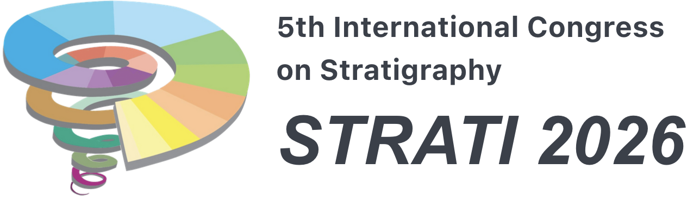

The [STRATI 2026 conference](https://strati2026.org/) is scheduled for June 28 – July 3, 2026 in Suzhou，China!

The STRATI Congress has long served as a cornerstone of international stratigraphic research, fostering dialogue and innovation across continents with a legacy rooted in Europe. As Earth science challenges and opportunities become increasingly interconnected, STRATI 2026 represents a pivotal opportunity to enhance global cooperation. Hosting this edition in Suzhou reflects the International Commission on Stratigraphy’s (ICS) dedication to promoting inclusive worldwide scientific exchange and addressing shared priorities in stratigraphic research. 

Please click on the image or link above to go to the conference homepage for more.
