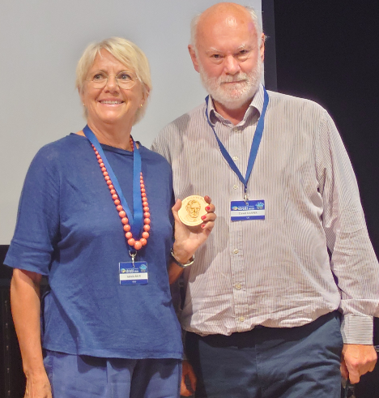
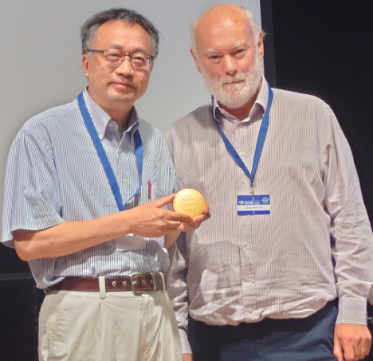
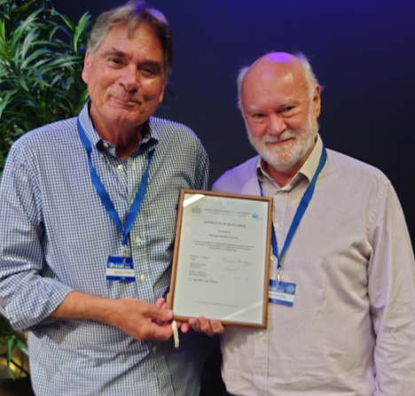

# ICS Prizes for 2023

## Digby McLaren Medal

The **2023 Digby McLaren Medal** is awarded to **Dr. Isabella Raffi**, former Professor of Paleontology at the University of Chieti, Italy, for her impressive body of research at the forefront of Cenozoic stratigraphy and correlation. She has been one of the most influential scientists in the fields of Cenozoic calcareous nannofossil taxonomy and their biostratigraphic and chronological use, with an extraordinarily prolific record of published work. Her rigorous and original research has contributed to highly cited publications that combine the classical methods of paleontology and stratigraphy with advanced, multidisciplinary studies. Her multiple contributions to stratigraphy range from the production of several geological maps to the participation in numerous expeditions of ocean drilling programs, successfully leading International Ocean Discovery Program Expedition 321 (Equatorial Pacific) in 2009. Prof. Raffi has contributed to the construction of the Geological Time Scale, including the establishment of the GSSPs for the Tortonian, Serravallian and Priabonian. She was the chair of the ICS Subcommission on Neogene Stratigraphy in 2012–2020. She has supported generations of young scientists, and set an example as a generous and empathetic leader. These accomplishments define a brilliant scientist and an eminently worthy recipient of the ICS Digby McLaren Medal.

## ICS Medal

The **2023 ICS Medal** is awarded to **Prof. Shuhai Xiao**, Professor of Geobiology in the Department of Geosciences at Virginia Tech for his significant contributions to Ediacaran stratigraphy. He is an internationally recognized expert in Proterozoic stratigraphy. He has made numerous contributions in Ediacaran chemo- and biostratigraphy for the improvement of chronostratigraphic subdivision and correlation. His comprehensive study on Ediacaran chemostratigraphy in South China led to the identification of key features for global correlation. His monographic work on Ediacaran microfossils from South China and northern India solidified the foundation for lower-middle Ediacaran biostratigraphy. His impactful research on Ediacaran trace fossils, skeletal fossils, and soft-bodied macrofossils paved the way for terminal Ediacaran biostratigraphy. He was the chair of the ICS Subcommission on Ediacaran Stratigraphy in 2012-2020.

## Certificate of Excellence

For over three decades our colleague **Professor Stan Finney** has promoted and supported stratigraphy at many different levels in our global community. As chair of the Ordovician Subcommission for 8 years, chair of the ICS for 8 years and Secretary General of the IUGS. He has many other achievements not least initiating the STRATI meetings and the IUGS world geological heritage sites project. On behalf of the ICS David Harper (ICS Chair) presented Stan Finney the Commission’s Certificate of Excellence, the first of its kind!