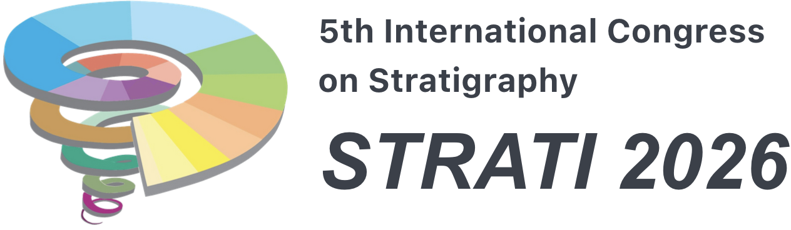

   
  

#### The International Commission on Stratigraphy (ICS) is the largest and oldest constituent scientific body in the International Union of Geological Sciences (IUGS). Its primary objective is to precisely define global units (systems, series and stages) of the International Chronostratigraphic Chart that, are the basis for the units (periods, epochs and age) of the International Geological Time Scale, thus establishing the fundamental scale for expressing the history of the Earth.  The work of the Commission is divided between seventeen subcommissions, each responsible for a specific period of geological time.  Their work is overseen by an executive of 6 officers.

  

  
<a href="news/152">Joint statement by the IUGS and ICS on the vote by the ICS Subcommission on Quaternary Stratigraphy</a>

  
21-03-2024

  

## News

* [STRATI 29026 in announced](news/154) [27-09-2025]
* [Albian and Hauterivian GSSP ceremonies](news/153) [12-08-2024]
* [Joint statement by the IUGS and ICS on the vote by the ICS Subcommission on Quaternary Stratigraphy](news/152) [21-03-2024]
* [Telychian & Aeronian GSSPs relocated](news/151) [09-02-2024]
* [The 2023/06 International Chronostratigraphic chart is released](news/150) [30-06-2023]
* [IUGC 2022 Annual Report](news/149) [30-05-2023]
* ["The Internetian Age" YouTube link](news/148) [06-02-2023]
* [New book on stratigraphical methods](news/147) [23-01-2023]
* [Prize nominations open](news/146) [18-01-2023]

  